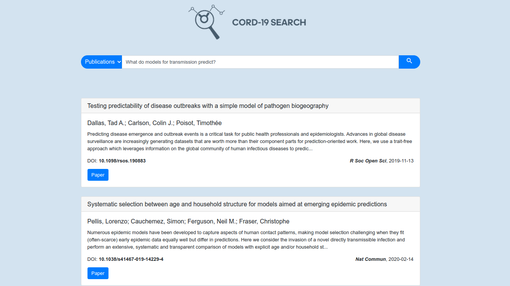
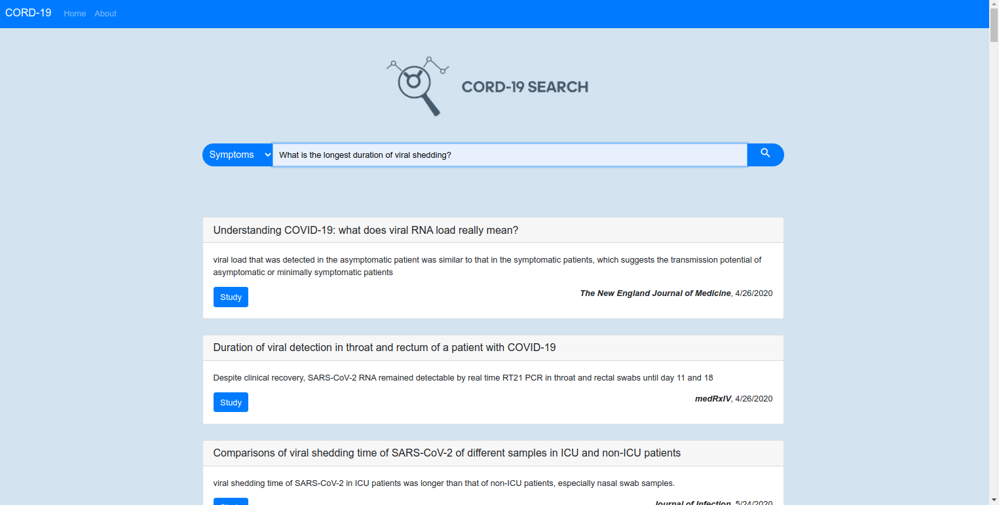
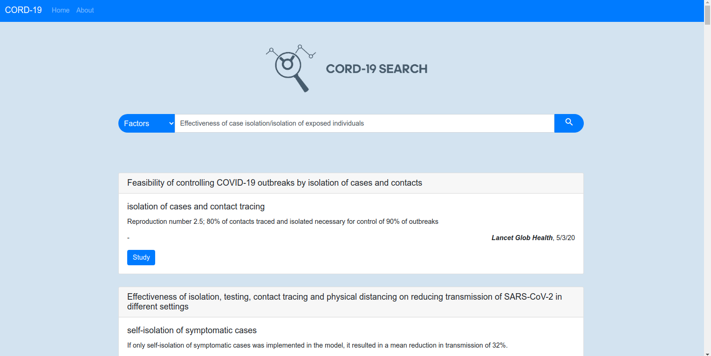

# Search-Engine-for-COVID-19-literature

A <b>Semantic Search Engine</b> for research papers on COVID-19 in various categories such as <b>symptoms, influential factors, similar diseases and viruses</b> etc. 
 
This is a solution to the CORD-19 challenge on Kaggle. The dataset was created in response to the COVID-19 pandemic containing over 500,000 scholarly articles, including over 200,000 with full text about COVID-19, SARS-CoV-2, and related coronaviruses. 

<a href="https://www.kaggle.com/allen-institute-for-ai/CORD-19-research-challenge">COVID-19 Open Research Dataset Challenge (CORD-19)</a> 

The challenge was to build a search engine/data mining tool that can accurately develop answers to high priority scientific questions in this domain. 
The size of the dataset is 46.71 GB as of now and more literature is periodically added. 
The dataset can be found <a href="https://www.kaggle.com/allen-institute-for-ai/CORD-19-research-challenge">here</a> and <a href="https://www.semanticscholar.org/cord19">here</a>.
 
The traditional approach is <b>key-word</b> based search using metrics such as <b>TF-IDF</b> or <b>BM25</b>. Although these methods do a solid job in providing good results, they fail to consider the sequence of words in the query. Moreover, with the increase in vocabulary, the vector size increases as well(one can use sparse vectors to overcome this problem). However, the major drawback of these approaches is that they fail to incorporate the semantics of the query or data.

To overcome this, <b>word/sentence embeddings</b> can be used that capture the meaning of the query much more accurately. 
- To use word embeddings, the query and data is represented by a weighted sum of the different word embeddings in a sentence(BM25 can be used to weigh the words).
- However, for sentence embeddings, no such processing needs to be done as the vectors already contain semantics of the entire text.  

Our solution uses sentence embeddings to encode the query and data and then compute the similarity scores between the two to rank the documents. 
To generate sentence embeddings, we use the <b>BioBERT model</b> - a pre-trained biomedical language representation model for biomedical text mining which produces 768-dimensional vectors.
The model can be found <a href="https://huggingface.co/gsarti/biobert-nli">here</a> and the corresponding paper <a href="https://arxiv.org/abs/1901.08746">here</a>.
We use the <a href="https://github.com/UKPLab/sentence-transformers/">Sentence Transformers: Multilingual Sentence, Paragraph, and Image Embeddings using BERT & Co.</a> framework to load the BioBERT model. 

The main issue that decreases the efficiency of search engines is the time taken to compute the similarity scores of the entire dataset with respect to the query. To overcome this issue, we use <a href="https://github.com/facebookresearch/faiss">Faiss</a>, a library for efficient similarity search and clustering of dense vectors. It contains algorithms that search in sets of vectors of any size, up to the ones that possibly do not fit in the RAM. It builds an index over the entire dataset and efficiently returns the top 'n' results. 

Question           |  Search Results
:-------------------------:|:-------------------------:
What do models for transmission predict?  |  
What is the longest duration of viral shedding? | 
Effectiveness of case isolation/isolation of exposed individuals  | 

<i>All the above questions are part of the CORD-19 challenge</i>

